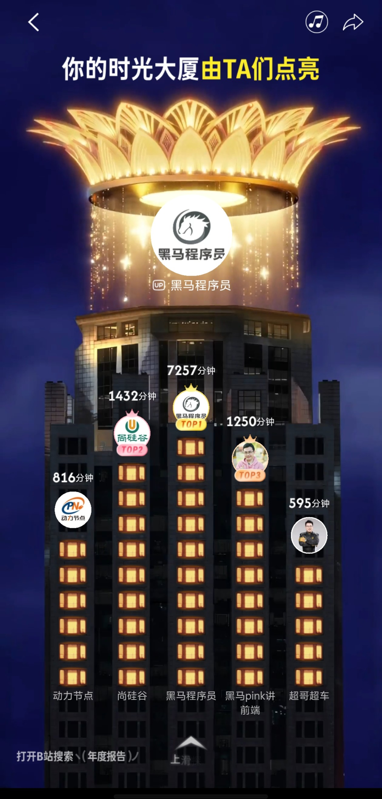
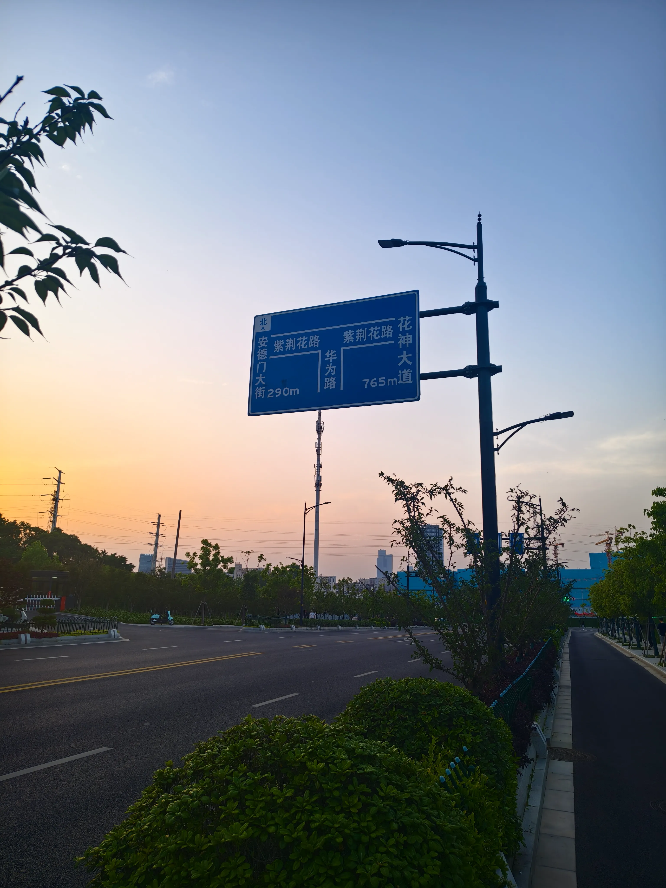
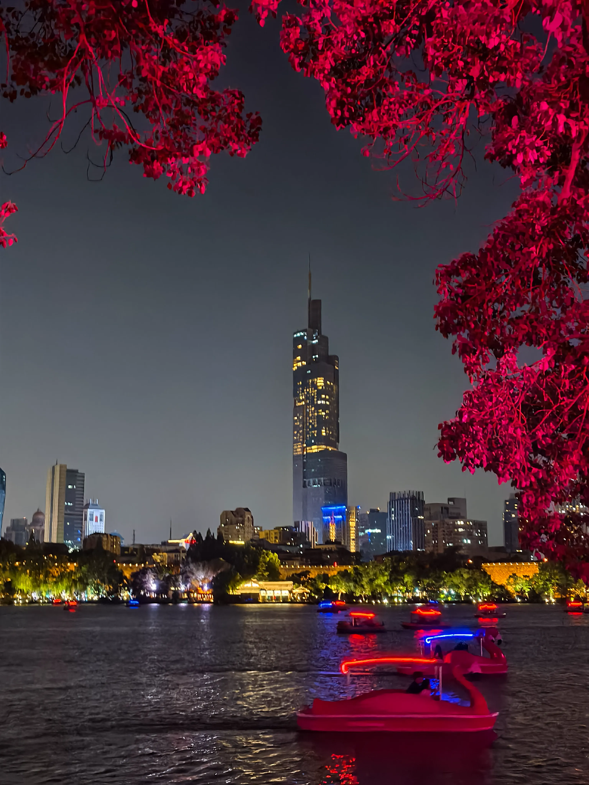
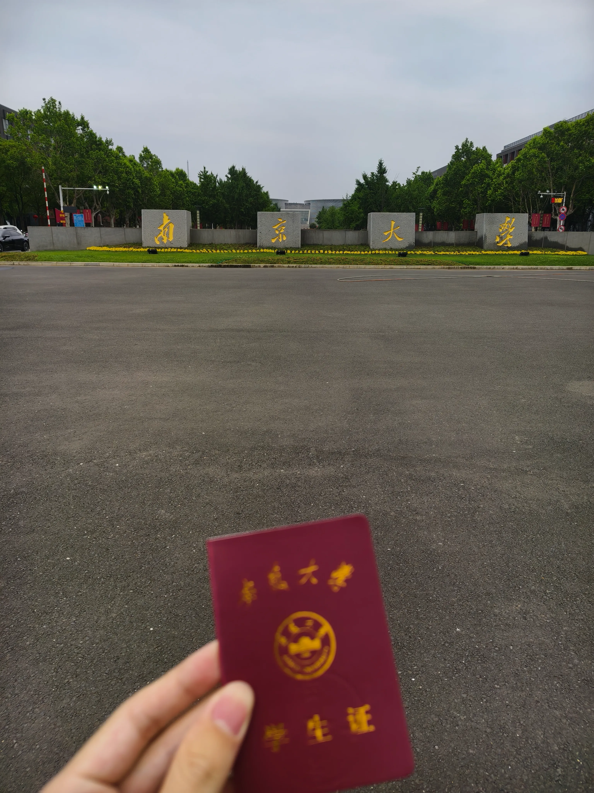

## 迟来的blog

### 缘由

其实我想写这篇博客已经很久了，在4月份的时候就已经基本部署好了这个站点，可当时却迟迟没有落下文字。或许是因为当时思绪尚浅，脑海中没有可写的东西，又或许是当时忙着找前端实习，所以博客的事情就搁置在了一旁。但是，真正让我动了强烈的做博客的愿望的其实是字节的面试，止步于三面，最后出了一道hard难度的算法题给我，拼尽全力无法战胜。于是我开始思考，当候选人都很厉害的情况下，人家凭啥选你？流水线上的可乐，经过了层层复杂的工艺才被做出来，可对于我们来说别无二致。所以我想，能发掘自己的特质，或许是一件有意义的事。技术文章和随笔，后续都会持续更新（应该吧）😄

### 学习历程

我一开始学的是Java那一套，但当时也是三天打渔两天晒网的学，也是可能是刚接触编程没多久吧，思维还没打开，从0到1的过程还是挺痛苦的。我曾经也想尝试去打ACM，如果能代表学校出去参加比赛，那该有多好。奈何自己实在没啥算法天赋，后面就放弃了。在学习Java的过程中，我接触到了前端，那个时候像突然发现了新大陆，前端怎么这么好玩，所见即所得，还可以有各种有意思的动画。然后当时秋招的行情普遍也是前端好点，于是我就转前端了，跑去学JS和Vue。实话说，在使用了浏览器的DevTools之后，我才真正弄懂了一个请求发起之后的流转过程，踏入了Web的门。

这是当时b站的学习时长(哔哩哔哩大学的含金量)

### 投递简历

我是大二开学9月份转前端的，那个学期学的确实挺猛，把Html CSS JS与Vue都过了一遍，也学了几个项目。等到下学期开学，我觉得学的差不多了，就做了我的第一版简历，并尝试在boss上投实习。没投多久就有一家合肥本地的公司跟我约了面试。第一次面试也是非常紧张，虽然面之前和豆包小姐预演了好多遍，并且面试官也挺好的，问的问题都比较简单，但是我依然结结巴巴的，话都说的不太利索。后面还是过了，约了二面。二面面完一周后，告诉我他们部门因为一些原因不招前端实习生了，第一次流程就这么地草草结束。我其实还是有些遗憾的。然后就是断断续续的投，那段时间心情也确实不好，网上都在说前端已经似了，各公司包括大厂都在裁前端开发，或者并入服务端。后来到4月中旬，被一家南京的小厂约面了，面我的就是我后来的mentor，以及hr姐。当时面了我40分钟，没几个小时就通过了，问我能不能来。我当时真的很开心，竟然真的能被接受，并且实习工资也还行。于是和家里人说过后，我在周末奔赴南京，并且飞速租好了房子。

### 南京实习

于是乎，我人生中第一份的实习工作就这么开始了。和我一起来的还有另一个实习生，他是大三的，做agent开发。mentor上来就扔了一份长长的需求文档给我，当时看到那么多需求要做，我人都傻了。开始几天，我跟mentor提过好几次，这么多需求，就我们俩怎么做的完。好在我的mentor特别好，跟我说开发中有什么问题尽管提，并且最后要是实在做不完也是他兜底😭。也是刚开始工作，还不太适应，后面做着做着，诶，感觉其实也还好。有coding agent，真正做起来还挺快的。

在第一天下班回去的路上，盛趣游戏的hr一个电话打过来，告诉我面试通过了。我当时面完盛趣其实没报啥希望，因为那个面试官就面了我15分钟，我想着怎么着也应该有二面。可是我已经接了这家小厂的活，只能婉拒了。盛趣在上海，虽然路途远些，但给的工资也高点，而且算是个大厂。我当时其实挺难受的，至今我也在想，如果当时选择去盛趣，又会是什么样子呢？

好在，南京实习的日子真的很不错，公司的人都挺好（除了那个后端，真是个大水货，技术太菜了），活也不算很多。除了我mentor，公司里的其他人也不会特地在意我一个实习生。于是我在空闲之余能随便摸鱼，有天还刷了一下午的力扣，哈哈。

有天下班，我忍不住拍了这张照片。那时，晚风徐徐拂过脸庞，我的脚步也飞快轻盈。南京的风，真的很暖，我的心情，更是雀跃到了极点。周末我也不闲着，去南京各个景点玩。总统府，中山陵，尤其是玄武湖，散发着巨大的能量场，漫步在湖边，感觉身心是放松而又平静。

玄武湖边的紫峰大厦

和南大同学面基时，拍的大门

当然，由于学校的事务，我得时不时回去，这一度让我十分头疼，跑了很多很多趟，甚至有天是中午回的学校，傍晚到的公司。我心疼我的钱包，路途过程中也感到些许疲惫。好在，我都handle过来了，包括期末考试。毕竟在外实习，这些都是必须克服的困难。

实习的日子飞逝，一转眼期末考试临近，也到了我离开的时候。项目基本上做完了，mentor对我的评价也挺好，拿到实习证明的那一刻，我开心极了，第一份工作也是圆满完成。然后就是从租的房子搬离，提着行李箱到高铁站的那刻，我的心中还有些不舍。快乐的日子总是短暂的，很幸运我能在我20岁的年纪生活在南京这座城市。也许我下一次还会回到南京，但再也不会有下一个20岁，在玄武湖，和一群来自五湖四海的陌生人一起唱歌了。

### 未来展望

经历了字节面试的失利后，我重新把后端的东西拾了起来。ai时代，确实不能停下学习的步伐，因此我正努力向全栈方向探索。（暑假还是休息了一段时间的）。未来的路还很长，我也不清楚之后会不会考研。当时三面的面试官跟我说，大家都开玩笑讲，如果学的够慢，就不用学了，基础的扎实程度还是很重要的。所以我也在思考，互联网不变的就是变化，谁知道后面的行情会怎么样，但是一个好的学历，是硬通货。而且，我的心里一直有一个梦想的院校。前途似海，来日方长，不要把梦想埋没，加油！！！
